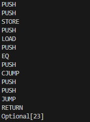

# GenesisVM

An implementation of a Virtual Machine using Java.
The virtual machine is capable of running instructions and interpreting bytecode. It also provides the flexibility to insert mnemonics and return the result accordingly.

## Instruction Mnemonics

The virtual machine supports the following instructions, categorized by their functionality:

```java
public enum Instruction {
    PUSH(0x00),
    POP(0x01),
    ADD(0x02),
    MUL(0x03),
    DIV(0x04),
    SUB(0x05),
    POW(0x06),
    MOD(0x07),
    RETURN(0x08),
    STOP(0x09),
    JUMP(0x0A),
    CJUMP(0x0B),
    LOAD(0x0C),
    STORE(0x0D),
    DUP(0x0E),
    SWAP(0x0F),
    GT(0x10),
    LT(0x11),
    EQ(0x12),
    LHS(0x13),
    RHS(0x14),
    NEG(0x15),
    AND(0x16),
    OR(0x17),
    XOR(0x18),
    JUMPDEST(0x19),
    NOT(0x1A),
    EXEC(0x1B),
    SLOAD(0x1C),
    SSTORE(0x1D);
    
    // ... (implementation details)
}
```

### Arithmetic Operations
`ADD`, `MUL`, `DIV`, `SUB`, `POW`, `MOD`, `NEG`

### Comparison Operations
`GT`, `LT`, `EQ`

### Bitwise Operations
`AND`, `OR`, `XOR`, `NOT`, `LHS`, `RHS`

### Stack Manipulation
`PUSH`, `POP`, `DUP`, `SWAP`

### Control Flow
`RETURN`, `STOP`, `JUMP`, `CJUMP`, `JUMPDEST`

### Memory Operations
`LOAD`, `STORE`

### State Storage and Retrieval
`SLOAD`, `SSTORE`

### Special Operations
`EXEC`


## Features

**Bytecode Interpretation**: 
The virtual machine can interpret bytecode and execute the specified instructions.

```java
VirtualMachine vm = new VirtualMachine();
byte[] bytecode = {
    00,00,00,00,0x17,   // PUSH 23
    00,00,00,00,03,     // PUSH 3
    03,                 // MUL
    0x08,               // RETURN
    };

Optional<Integer> result = vm.byteInterpreter(bytecode); // result of 23 * 3 should be 69

if (result.isPresent()) {
    System.out.println("Result: " + result.get()); // Result: 69
} else {
    System.out.println("No Result!");
}
```

**Mnemonics Execution**:
In addition to bytecode, the virtual machine allows you to use mnemonics for a more human-readable input.

```java
// 1 int is 4 bytes, so the representation of 23 is 00 00 00 17
String mnemonics = "PUSH 00 00 00 17 PUSH 00 00 00 03 MUL RETURN" ;

byte[] bytecodeFromMnemonics = vm.mnemonicsToByteCode(mnemonics); //converting from mnemonics to bytecode

Optional<Integer> resultFromMnemonics = vm.byteInterpreter(bytecodeFromMnemonics); // interpretating our bytecode

if (resultFromMnemonics.isPresent()) {
    System.out.println("Result: " + resultFromMnemonics.get()); // Result: 69
} else {
    System.out.println("No Result!");
}
```
**Memory Operations**: 
The virtual machine supports operations like loading and storing values in memory.

**Control Flow**: 
Jump and conditional jump instructions allow for control flow manipulation with a jump destination instruction for safety.

**State Persistence**: 
The state of the virtual machine, including memory, can be persisted to JSON files (State.json and Database.json).


## Code Structure
The project is organized into three main classes:

`Instruction`: Enum representing the supported instructions with their corresponding byte values.

`VirtualMachine:` The core virtual machine class responsible for bytecode interpretation and execution.
 
`State`: Represents the state of the virtual machine, including the stack and memory.


## Fun Manipulation

We can test random algorithms using our VM by providing mnemonics or direct bytecode.

So let's try to make a test algorithm that returns `69` if the last two args of the stack are equal, and returns `23` if otherwise.

```java
    // testing if the last two elements of the stack are equal (in that case below if 7 == 7)
    String ifMnemonics = "PUSH 00 00 00 07 PUSH 00 00 00 00 STORE PUSH 00 00 00 00 LOAD PUSH 00 00 00 07 EQ PUSH 00 00 00 28 CJUMP PUSH 00 00 00 17 PUSH 00 00 00 2E JUMP JUMPDEST PUSH 00 00 00 45 JUMPDEST RETURN";

    System.out.println(vm.byteInterpreter(vm.mnemonicsToByteCode(ifMnemonics))); // Should return 69
```

The result:


```java
    // the same thing (but in this case comparing 3 with 7)
    String ifMnemonics = "PUSH 00 00 00 03 PUSH 00 00 00 00 STORE PUSH 00 00 00 00 LOAD PUSH 00 00 00 07 EQ PUSH 00 00 00 28 CJUMP PUSH 00 00 00 17 PUSH 00 00 00 2E JUMP JUMPDEST PUSH 00 00 00 45 JUMPDEST RETURN";

    System.out.println(vm.byteInterpreter(vm.mnemonicsToByteCode(ifMnemonics))); // Should return 23
```

The result:




Now to elevate the fun, I wrote and tested a set of bytecode instructions manually to execute an algorithm that returns the summation of 11 ( ∑ 11 )

```java
        VirtualMachine vm = new VirtualMachine();
        byte[] summationOfElevenByteArray = {
            //push 11
            00,00,00,00,0x0B,
            //push 1
            00,00,00,00,01,
            //store 00 01
            00,00,00,00,01,
            0x0D,
            //store 00 00
            00,00,00,00,00,
            0x0D,
            //push 0
            00,00,00,00,00,
            //push 1
            00,00,00,00,01,
            //store 00 03
            00,00,00,00,03,
            0x0D,
            //store 00 02
            00,00,00,00,02,
            0x0D,
            //load 00 02 -starting the loop
            0x19,
            00,00,00,00,02,
            0x0C,
            //load 00 03
            00,00,00,00,03,
            0x0C,
            //add
            02,
            //store 00 02
            00,00,00,00,02,
            0x0D,
            //load 00 03
            00,00,00,00,03,
            0x0C,
            //push 1
            00,00,00,00,01,
            //add
            02,
            //store 00 03
            00,00,00,00,03,
            0x0D,
            //load 00 03
            00,00,00,00,03,
            0x0C,
            //load 00 00,
            00,00,00,00,00,
            0x0C,
            //eq
            0x12,
            0x1A,
            00,00,00,00,0x2C,
            //cjump - conditional jump to loop
            0x0B,
            //load 00 02
            00,00,00,00,02,
            0x0C,
            //load 00 00
            00,00,00,00,00,
            0x0C,
            //add - last argument
            02,
            //return
            0x08 

        };

        System.out.println(vm.byteInterpreter(summationOfTwentyThreeByteArray)); // should return 66
```

The result of the interpretation and VM execution (66):

```PUSH
PUSH
PUSH
STORE
PUSH
STORE
PUSH
PUSH
PUSH
STORE
PUSH
STORE
JUMPDEST
PUSH
LOAD
PUSH
LOAD
ADD
PUSH
STORE
PUSH
LOAD
PUSH
ADD
PUSH
STORE
PUSH
LOAD
PUSH
LOAD
EQ
NOT
PUSH
CJUMP
44
PUSH
LOAD
PUSH
LOAD
ADD
PUSH
STORE
PUSH
LOAD
PUSH
ADD
PUSH
STORE
PUSH
LOAD
PUSH
LOAD
EQ
NOT
PUSH
CJUMP
44
PUSH
LOAD
PUSH
LOAD
ADD
PUSH
STORE
PUSH
LOAD
PUSH
ADD
PUSH
STORE
PUSH
LOAD
PUSH
LOAD
EQ
NOT
PUSH
CJUMP
44
PUSH
LOAD
PUSH
LOAD
ADD
PUSH
STORE
PUSH
LOAD
PUSH
ADD
PUSH
STORE
PUSH
LOAD
PUSH
LOAD
EQ
NOT
PUSH
CJUMP
44
PUSH
LOAD
PUSH
LOAD
ADD
PUSH
STORE
PUSH
LOAD
PUSH
ADD
PUSH
STORE
PUSH
LOAD
PUSH
LOAD
EQ
NOT
PUSH
CJUMP
44
PUSH
LOAD
PUSH
LOAD
ADD
PUSH
STORE
PUSH
LOAD
PUSH
ADD
PUSH
STORE
PUSH
LOAD
PUSH
LOAD
EQ
NOT
PUSH
CJUMP
44
PUSH
LOAD
PUSH
LOAD
ADD
PUSH
STORE
PUSH
LOAD
PUSH
ADD
PUSH
STORE
PUSH
LOAD
PUSH
LOAD
EQ
NOT
PUSH
CJUMP
44
PUSH
LOAD
PUSH
LOAD
ADD
PUSH
STORE
PUSH
LOAD
PUSH
ADD
PUSH
STORE
PUSH
LOAD
PUSH
LOAD
EQ
NOT
PUSH
CJUMP
44
PUSH
LOAD
PUSH
LOAD
ADD
PUSH
STORE
PUSH
LOAD
PUSH
ADD
PUSH
STORE
PUSH
LOAD
PUSH
LOAD
EQ
NOT
PUSH
CJUMP
44
PUSH
LOAD
PUSH
LOAD
ADD
PUSH
STORE
PUSH
LOAD
PUSH
ADD
PUSH
STORE
PUSH
LOAD
PUSH
LOAD
EQ
NOT
PUSH
CJUMP
PUSH
LOAD
PUSH
LOAD
ADD
RETURN
Optional[66]
```